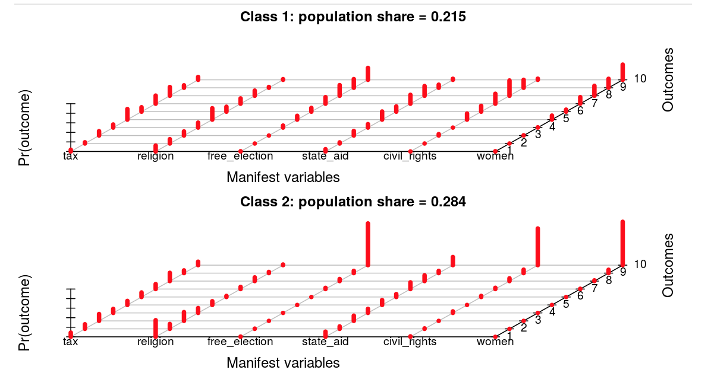
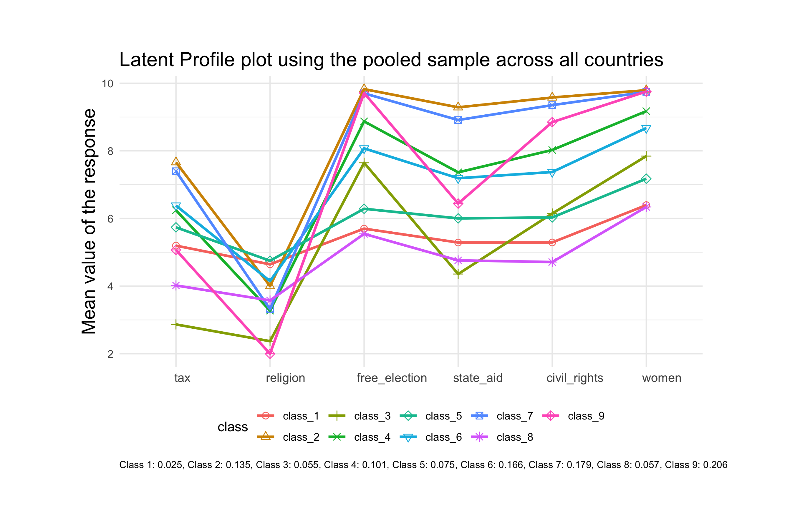

```{r, include = FALSE}
knitr::opts_chunk$set(
  collapse = TRUE,
  comment = "#>"
)
```

```{r setup}
library(LCAplotter)
```

## Motivation and introduction

This is a package built on top of utilities provided by the [poLCA](https://cran.r-project.org/web/packages/poLCA/index.html) package. 

Latent class analysis (LCA) or Latent profile analysis (LPA), which uses a parametric model to place respondents into classes (or clusters) based on 
their response patterns. In LPA, the number of classes is determined by the expectation-maximization algorithm 
which involves an iterative process until the model converges on a best fit for the data. 
This involves the notion that there should be shared variance within the clusters, and that clusters should be 
empirically distinct from each other. For more detailed introduction to the method, please refer [here](https://stats.idre.ucla.edu/mplus/seminars/lca/)

LCA has been extensively used in social science however the visualization component is poorly implemented in R compared with its counterparts Mplus or STATA.

The poLCA package only offers the following 3D plots, which is explicit in itself, however, may not be propoer for more rigrous research settings:

<p align="center">
  
</p>

This package contributes to solving this plot by adding visualization capasities to facilitate broader usage of LCA. 

## Termenology explanation

**Item response variable:** In orde to conduct LCA modeling, you would usually need to have a set of item response variables, and such item response variables usually taps into certain specific aspects of (a) broader theoretical construct(s). For example, to measure democracy, there are 6 or 7 item response variable with each of them covering one particular parf of democracy. For example, one item response variable is related to the taxation while another related to women's rights. 

**formula:** This is the required piece for the poLCA package to fit the LCA model. A formula expression is of the form response ~ predictors. LCAplotter package adopts the way formula parameter is defined from the poLCA package.

## Data
LCAplotter has encapsulated an example dataset called democracy. The view of the dataset is as follows:
```{r, warning = F, message = F}
knitr::kable(democracy[1:10,]) 
```

Note: This data format is important because both poLCA and LCAplotter depend on this format in order to function properly. **Thus, please make sure in your data, you have item response variables as columns.**

After loading the LCAplotter package via 

```{r, eval = F}
library(LCAplotter)
# or
require(LCAplotter)
```

you could directly access the data by calling its name 

```{r, eval = F}
democracy
```


This dataset is an extracted from the [World Value Survey wave 5](http://www.worldvaluessurvey.org/WVSDocumentationWV5.jsp) and subsetted from the US sample. All the item response variables are measureing the 'essential characteristics of democracy' and there are in total 6 of them. 

Individuals are asked to read the following prompt:

> Many things may be desirable, but not all of them are essential characteristics of democracy. Please tell me for each of the following things how essential you think it is as a characteristic of democracy. Use this scale where 1 means “not at all an essential characteristic of democracy” and 10 means it definitely is “an essential characteristic of democracy.”

The 6 item statements are:

1. Government taxes rich to subsidize poor; 
2. Religious authorities interpret laws; 
3. People choose leaders in free elections; 
4. People receive state aid for employment; 
5. Civil rights protect people’s liberties from state oppression; 
6. Women have the same rights as men.

We would like to conduct LDA to find how many hidden classes (latent clusters) are there among our sample data (N = 1182). Each hidden class may have different understanding or answering patterns for those 6 item response variables. 

### poLCA model object

Because LCAplotter is built on top of poLCA, we are inheriting the model object from poLCA. The poLCA model object is a list of diverse outputs. The most related output is the **probs** list, which is a 3 dimentional tensor with dimentionality as **$item\ response \times class \times probability$**.

A more explicit view could be seen below:

<p align="center">
  
</p>

This model object is important because we need to feed it into the visualization functions. 

## Visualization

### Finding the most optimal model

Before visualizing the final model, we need to find out the optimal model according to the fit indices.
This could be achieved by running the **find_best_fit** function.
```{r, eval = F}
formula = cbind(tax, religion, free_election, state_aid, civil_rights, women) ~ 1
best_model = find_best_fit(democracy, formula)
```


```{r, cache = T, include= F}
formula = cbind(tax, religion, free_election, state_aid, civil_rights, women) ~ 1
best_model = find_best_fit(democracy, formula)
```

```{r}
print(best_model)
```


The default criterion used to find the optimal model fit is BIC. This could be easily changed by speficifying other fitting indices such as "aic" or "Gsq", speficially, you could do as follows:

```{r, eval = F}
best_model = find_best_fit(democracy, formula, criterion = 'aic')

# or

best_model = find_best_fit(democracy, formula, criterion = 'Gsq')
```

Further, we could change the search space for the searching of the most optimal model. The default search space is from 1 - 7 classes (clusters). If you want to enlarge the search space to 9, for example, you could change the parameter as:

```{r, eval = F }
best_model = find_best_fit(democracy, formula, criterion = 'Gsq', maximum_num_class = 9)
```

The find_best_fit function will return an poLCA model object, which affords us to move forward to visualizations.

### profile_plot

The profile plot looks like the following:
<p align="center">
  
</p>

To construc profile plot, you could run the profile_plot function: 

```{r, eval = F}
plot = profile_plot(democracy, num_var = 6, model = NULL, form = formula, maximum_num_class = 2)
```

```{r, message= F, warning = F, eval = T, include= F}
plot = profile_plot(democracy, num_var = 6, model = NULL, form = formula, maximum_num_class = 2)
```

```{r}
print(plot)
```


The plot object has been returned and it could be further customized by adding more ggplot syntax. For example:

```{r}
print(plot + 
        ggtitle("A test title"))
```


profile_plot function also wraps in the parameters for the poLCA package. Thus if you want to customized the model fitting parameters of poLCA funtion such as calc.se = FALSE, you could directly pass it in the parameters of the profile plot. 

### stacked_bar plots

There are two operationalization for the stacked_bar plots
1. stacked_bar_by_class
2. stacked_bar_by_item


#### stacked_bar_by_class plot

This is the stacked bar plot facetted by the different classes. Each class would have its own 'window' and within each 'window' you could view its correponding probabilities for each item response. An example would look like this:

```{r}
p = stacked_bar_by_class(best_model)
```

This plot offers us a direct comparison of answer patterns for each item response variable WITHIN a certain class. For example, in class 1, the 'women', 'free election', and 'civil rights' are generally more agreed than 'taxation', 'staet aid', and 'religion.' However, the class 3 shows a huge contrasts with class 1 in that ALL of the item response variables are less agreeed upon than class 1. 

The return object is a ggplot object which supports further custmization of ggplot syntax.

Further, this function supports the color palatte from the **RColorBrewer** package. The default palatte used is called "Greys". You could customize the color palette simply by:

```{r}
p = stacked_bar_by_class(best_model, color_palette = 'Set2')

```

All of the color palettes could be view from below:

```{r}
RColorBrewer::display.brewer.all()
```

#### stacked_bar_by_item plot

This is the stacked bar plot facetted by the different items. Each item would have its own 'window' (facets) and within each facets you could view its correponding probabilities for each class (clusters). An example would look like this:

```{r}
p = stacked_bar_by_item(best_model)

```

This plot offers us direct comparison of the differences between classes on each item response. For example, we could view directly that for the women rights variable, the class 1 is way higher compared with the other two classes.

You could change the color palettes as well by specifying the color_palette paramter.


